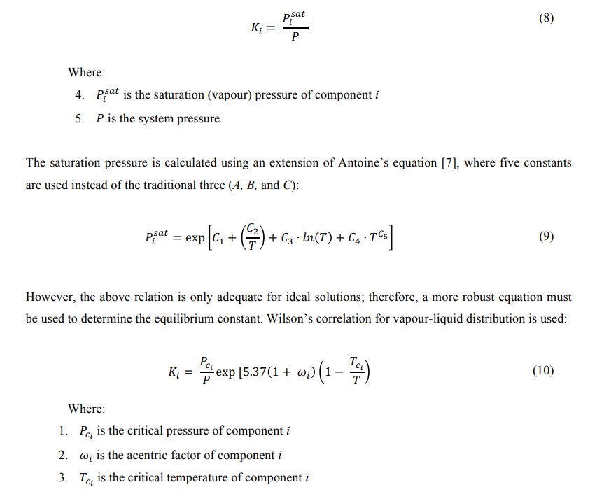

# Vapour-Liquid Equilibrium Simulator (Flash simulator)

This was my first venture into object oriented programming in Java back in 2018, a lifetime ago. This was developed with no source control and with no knowledge of design patterns.

## Description

This simulator uses Raoult's law, and Wilson and/or Standing Correlation and Peng Robinson equation of state to provide vapour-liquid equilibrium compositions for both ideal (former) and non-ideal conditions (later) for varied polar and non-polar composition feeds.

It solves three cases:

- Uses an operating temperature, the tank pressure, the feed composition, and the feed flow rate to calculate the vapour and liquid outlet compositions and flow rates, and the amount of heat required to maintain the operating temperature specified
- Uses the feed temperature, the tank pressure, the feed composition, and the feed flow rate to calculate the flash temperature of the mixture, the vapour and liquid outlet compositions as well as the outlet flow rates.
- Uses the flash temperature, tank pressure, feed composition and feed flow rate to calculate the feed temperature, the vapour and liquid compositions and adiabatic flash flow rates

Binary interaction parameters are calculated using semi-emperical models see References.

Validation was done using unisim.

## VLE Implementation:

## Equations

### Nomenclature

### Governing Equations

### Derivations

 
 
 
 
 
 
 
 

### Numerical Methods

#### Ridders Method

Root finding method used to solve Rachford-Rice equation:

 

#### Cardano's Method

Root finding method for third degree polynomials. Used to solve the compressibility factor for Peng Robinson equation of state:

 

## Disclaimer

This project is provided for learning purposes only. I take no responsibility for its misuse or any damages caused by its use.

## References

- V. Plee, J.-N. Jaubert, R. Privat and P. Arpentinier, “Journal of Petroleum Science and Engineering,” Extension
  of the E-PPR78 equation of state to predict fluid phase equilibria of natural gases containing carbon
  monoxide, helium-4 and argon, vol. 133, p. 27, 2015.
- M. Hajiw, A. Chapoy and C. Coquelet, “The Canadian Journal of Chemical Engineering,” Hydrocarbons -
  Water Phase Equilibria Using the CPA Equation of State with a Group Contribution Method, vol. 93, pp. 432-
  442, 2015.
- D.-y. Peng and D. B. Robinson, “A New Two-Constant Equaion of State,” in 4th International Heat Transfer
  Conference, Paris-Versailles, 1970.
- C. Geankoplis, Transport Processes and Unit Operation, 3rd ed., New York: Pretence Hall, 1993.
- W. McCabe, J. C.Smith and P. Harriott, Mcabe unit operations of chemical engineering, F. Edition, Ed., New
  York: McGraw-Hill Inc, 1993
- M. M. Martin Iggland, “Introduction to Chemical Engineering for Lecture 7: Flash Distillation,” Zurich, 2015
- R. H. a. D. W. G. Perry, Perry's Chemical Engineers' Handbook, New York: McGraw-Hill, 2008.
